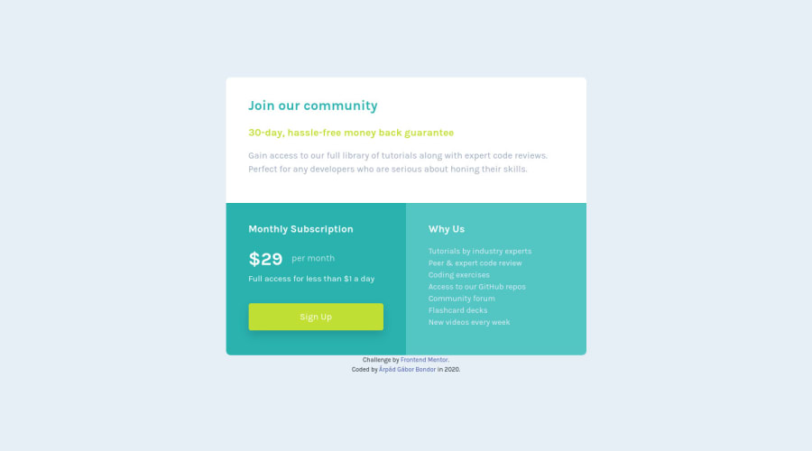

# Frontend Mentor - Single price grid component solution

This is a solution to the [Single price grid component challenge on Frontend Mentor](https://www.frontendmentor.io/challenges/single-price-grid-component-5ce41129d0ff452fec5abbbc). Frontend Mentor challenges help you improve your coding skills by building realistic projects.

## The challenge

Your users should be able to:

-   View the optimal layout for the component depending on their device's screen size
-   See a hover state on desktop for the Sign Up call-to-action

## Screenshot

## Links

-   Solution URL: [Frontend Mentor solution](https://www.frontendmentor.io/solutions/mobile-first-html5-css3-bootstrap4-PK97IvMrh)
-   Live Site URL: [Deployed on Github Pages](https://arpadgbondor.github.io/Web_challenge_2-Frontend_Mentor-Single-price-grid-component/)

## Built with

-   HTML5
-   CSS3
-   Bootstrap4
-   Mobile-first workflow

## Author

-   Github - [Arpad G. Bondor](https://github.com/ArpadGBondor)
-   Frontend Mentor - [Arpad G. Bondor](https://www.frontendmentor.io/profile/ArpadGBondor)
